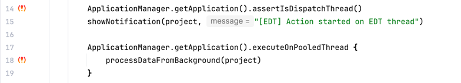

# Threading Highlighter

Threading Highlighter — это инструмент динамического анализа для разработчиков плагинов IntelliJ Platform.
Он помогает определить, какие [threading-контракты](https://plugins.jetbrains.com/docs/intellij/threading-model.html) необходимо соблюдать при использовании конкретного метода.

Инструмент работает в два этапа:
1. **Сбор данных (agent).** Java-агент инструментирует пользовательский код и отслеживает threading-маркеры в рантайме (встроенные в код IntelliJ Platform). При каждом срабатывании маркера агент записывает инструкции из stack trace. Это позволяет зафиксировать все точки пользовательского кода, которые входят в цепочку вызовов до маркерной инструкции.
2. **Визуализация (plugin).** Плагин для IntelliJ загружает собранные данные трассировки и отображает иконки на полях редактора (gutter) напротив строк, попавших в трассировки. Так разработчик видит актуальные threading-контракты прямо в среде разработки во время написания кода.


## Структура проекта

```
ThreadingHighlighter/
├── common/     — разделяемые модели данных
├── agent/      — Java-агент (Byte Buddy) для инструментации маркеров
├── plugin/     — IntelliJ Platform плагин для визуализации результатов
└── examples/   — демонстрационный плагин с тестовыми actions
```
## Использование

### 1. Сборка агента и плагина

```bash
# Сборка agent (shadow JAR со всеми зависимостями)
./gradlew :agent:shadowJar

# Сборка плагина (ZIP-дистрибутив)
./gradlew :plugin:buildPlugin
```

Артефакты:
- Agent JAR: `agent/build/libs/agent.jar`
- Plugin ZIP: `plugin/build/distributions/`

### 2. Подключение Java-агента к виртуальной машине
Для подключения агента в файле build.gradle.kts пользовательского проекта необходимо указать 
- JVM-аргумент `-javaagent/path/to/agent.jar`, где находится собранный JAR-файл агента;
- свойство `threading.highlighter.project.dir` — путь, относительно которого агент создаст директорию .ij-threading-highlighter/ для хранения trace-файлов.
Также требуется задать системное свойство `threading.highlighter.project.dir` — путь, относительно которого агент создаст директорию `.ij-threading-highlighter/` для хранения файлов трассировки.


Пример конфигурации в build.gradle.kts:
```
tasks {
    runIde {
        jvmArgs(
            "-javaagent:/path/to/agent.jar"
        )
        systemProperty(
            "threading.highlighter.project.dir", "${project.projectDir}"
        )
    }
}
```
После этого можно запускать тестовую IDE с пользовательским плагином. Агент будет инструментировать код, выполняющийся при воспроизведении анализируемых сценариев.

### 3. Установка плагина

Установите собранный ZIP-дистрибутив в рабочую IDE (ту, где ведётся разработка пользовательского плагина):

`Settings` → `Plugins` → ⚙️ → `Install Plugin from Disk…` → выберите файл из `plugin/build/distributions/`.

### 4. Просмотр результатов
Чтобы визуализировать собранные данные трассировки:

1. Tools → Threading Highlighter → Reload Threading Traces — загрузка и индексация trace-файлов.
2. В редакторе отобразятся gutter-иконки на полях напротив строк кода, попавших в трассировки маркеров.
3. Tools → Threading Highlighter → Show Trace Summary — сводная статистика по всем загруженным записям.

### Быстрый старт
Для проверки работоспособности инструмента предусмотрен модуль `examples`:
```
./gradlew :examples:runIde
```
Gradle автоматически соберёт агент, подключит его к запускаемой IDE и настроит необходимые системные свойства.

После закрытия тестовой IDE выполните `Reload Threading Traces` в рабочей IDE — в коде модуля `examples/` появятся gutter-иконки с результатами анализа.

