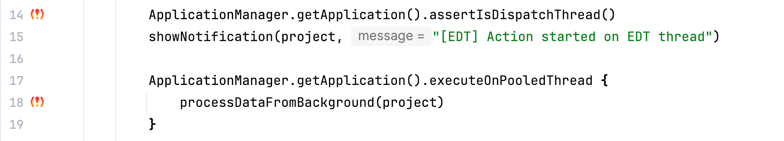

# Threading Highlighter

Threading Highlighter — инструмент динамического анализа для разработчиков плагинов IntelliJ Platform.
Он показывает, какие [threading-контракты](https://plugins.jetbrains.com/docs/intellij/threading-model.html) фактически действуют на конкретных строках кода.

Инструмент состоит из двух компонентов:

1. **Агент (сбор данных).** Java-агент инструментирует threading-ассерты платформы. При каждом срабатывании агент обходит стек (`StackWalker`) и записывает в JSONL-файлы фреймы кода анализируемого плагина — только из базовых пакетов, объявленных через белый список (`threading.highlighter.include.packages`).
2. **Плагин (визуализация).** Загружает записанные трассы и отображает gutter-иконки напротив строк, попавших в стек до ассерта.



## Назначение

Threading-контракты (EDT-only, non-EDT, slow operations, read/write access) не выражены в сигнатурах методов: обязательность контракта определяется тем, через какие ассерты платформы вызов фактически проходит в рантайме. Реальная цепочка вызовов складывается динамически — через колбэки платформы, `invokeLater`, пулы потоков и точки расширения `plugin.xml`.

Threading Highlighter наблюдает фактические срабатывания ассертов в работающей IDE и фиксирует, какой участок кода плагина к ним привёл. По gutter-иконке видно, через какой ассерт реально прошёл вызов.

Ограничение метода: инструмент показывает контракты только для путей выполнения, реально пройденных за сессию. Невоспроизведённый сценарий трасс не даст.

## Маркеры

Инструментируются ассерты обеих осей threading-модели. Внутренний код платформы вызывает часть ассертов напрямую через `ThreadingAssertions`, минуя `ApplicationImpl`, — поэтому инструментируются оба класса.

| Контракт | Методы платформы |
|---|---|
| EDT (должен работать на UI-потоке) | `ApplicationImpl#assertIsDispatchThread`, `ThreadingAssertions#assertEventDispatchThread` |
| Non-EDT (фоновый поток) | `ApplicationImpl#assertIsNonDispatchThread`, `ThreadingAssertions#assertBackgroundThread` |
| Read Access (`runReadAction`) | `ApplicationImpl#assertReadAccessAllowed`, `ThreadingAssertions#assertReadAccess` |
| Write Access (`runWriteAction`) | `ApplicationImpl#assertWriteAccessAllowed`, `ThreadingAssertions#assertWriteAccess` |
| Slow Operation (тяжёлая операция/I-O) | `SlowOperations#assertSlowOperationsAreAllowed` |

Список фиксированный: агент копирует advice в эти методы на этапе загрузки классов. Расширение — одной записью в `Markers.java`.

## Структура проекта

```
ThreadingHighlighter/
├── common/     — разделяемые модели данных (чистая Java)
├── agent/      — Java-агент (Byte Buddy)
├── plugin/     — плагин визуализации
└── examples/   — демо-плагин с тестовыми actions
```

## Архитектура запуска: две разные JVM

```
JVM #1 — рабочая IDE                 JVM #2 — sandbox-IDE (runIde)
├─ установлен плагин              ├─ выполняется анализируемый код
├─ рисует gutter-иконки            ├─ подключён агент (-javaagent)
└─ читает готовые .jsonl           └─ агент пишет .jsonl
                         │
                         └─ обмен через файлы .ij-threading-highlighter/
```

`-javaagent` — флаг старта JVM, поэтому агент прописывается в `build.gradle.kts` анализируемого проекта.

## Условия работы

1. **Целевой код — плагин IntelliJ Platform**, запускаемый через `runIde` (обычное JVM-приложение threading-ассерты не вызывает).
2. **Задан белый список пакетов** `threading.highlighter.include.packages` — без него агент не захватит ни одного фрейма (граница пакета учитывается: `com.example` включает `com.example.Foo`, но не `com.exampleOther.Bar`).
3. **Код плагина находится в стеке** в момент срабатывания ассерта: ассерты, вызванные платформой для собственных нужд, в трассу не попадают.
4. **Рабочая IDE попадает в диапазон `sinceBuild`/`untilBuild` плагина** (текущий: build 253).

## Использование

1. **Установите плагин** в рабочую IDE: `Settings → Plugins → ⚙️ → Install Plugin from Disk…` → `plugin/build/distributions/plugin-0.1.0.zip`.
2. **Получите VM-аргументы**: `Tools → Threading Highlighter → Enable Agent...` — диалог выдаёт готовую строку `-javaagent:… -Dthreading.highlighter.project.dir=… -Dthreading.highlighter.include.packages=<your.base.package>`.
3. **Вставьте строку** в `runIde` анализируемого проекта, заменив `<your.base.package>` на базовый пакет плагина:

```kotlin
tasks {
    runIde {
        jvmArgs("-javaagent:/path/to/agent.jar")
        systemProperty("threading.highlighter.project.dir", "${project.projectDir}")
        systemProperty("threading.highlighter.include.packages", "com.example.myplugin")
    }
}
```

4. **Запустите `runIde`**, воспроизведите сценарии, закройте sandbox-IDE и вернитесь в рабочую IDE.

Сборка из исходников:

```bash
./gradlew :agent:shadowJar        # agent/build/libs/agent-0.1.0.jar
./gradlew :plugin:buildPlugin     # plugin/build/distributions/plugin-0.1.0.zip
```

### Параметры агента

Обязательны: `-javaagent`, `threading.highlighter.project.dir`, `threading.highlighter.include.packages`.

Необязательные:

| Свойство | По умолчанию | Назначение |
|---|---|---|
| `threading.highlighter.append.session` | `false` | Накопление трасс за несколько запусков (корректно только при неизменном коде) |
| `threading.highlighter.max.stack.depth` | `128` | Максимальная глубина захвата стека |
| `threading.highlighter.flush.interval.minutes` | `15` | Интервал сброса трасс на диск (полный сброс — при завершении JVM) |
| `threading.highlighter.min.capture.interval.millis` | `0` | Минимальный интервал между захватами для одного маркера |

### Просмотр результатов

1. Трассы перезагружаются автоматически при изменении файлов; вручную — `Tools → Threading Highlighter → Reload Threading Traces`.
2. Gutter-иконки появляются на строках, попавших в трассы. Если файл редактировался после записи, подсказка предупреждает о возможном смещении номера строки.
3. `Show Trace Summary` — сводка загруженных трасс; `Hide/Show Threading Markers` — включение/выключение значков.

## Демонстрационный пример

Модуль `examples` — демонстрационный плагин с тестовыми actions, где подключение агента уже настроено. Он показывает инструмент в действии и не предназначен для анализа реальных проектов: используйте его, чтобы проверить установку и увидеть gutter-иконки, а затем подключайте агент к своему плагину по инструкции выше.
